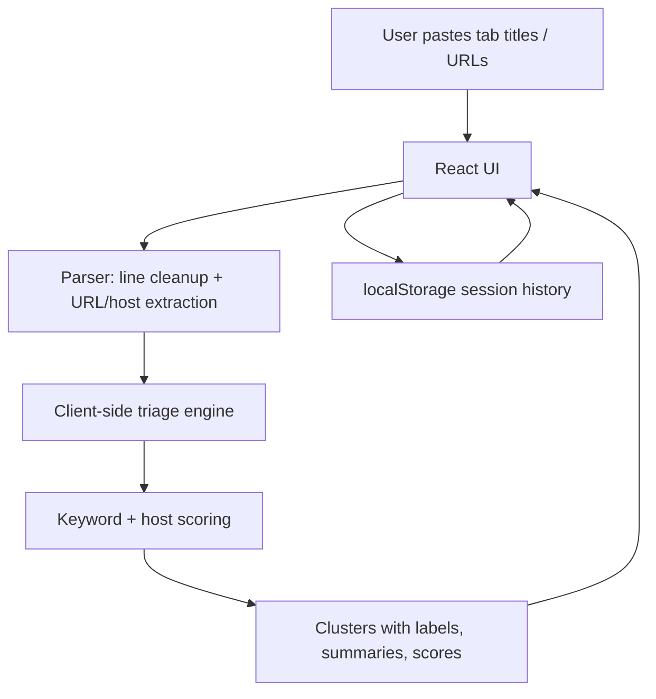

# Tab Triage

A tiny browser-based workspace for turning a messy list of open tabs, page titles, or URLs into a few actionable buckets.

The MVP runs entirely in the browser. Paste your tab dump, click **Triage tabs**, and the app parses titles/URLs, clusters similar items, labels each group, and suggests what to do next.

## Architecture



## Run locally

Requirements: Node.js 18+ and npm.

```bash
npm install
npm run dev
```

Open the printed Vite URL, usually <http://localhost:5173>.

## One-command smoke check

```bash
npm run test:smoke
```

This validates the TypeScript build path without emitting files.

## Environment variables

Copy `.env.example` to `.env` if you want to customize local settings.

| Variable | Required | Description |
| --- | --- | --- |
| `VITE_APP_ENV` | No | Optional label for the running environment. Displayed subtly in the footer. |

No API key is required. The "AI-generated" grouping in this MVP is implemented as a deterministic local heuristic: URL host extraction, topic keyword scoring, fallback domain grouping, and concise generated labels/actions.

## Paste format examples

Any of these work, mixed together:

```text
https://react.dev/learn
React useEffect cleanup patterns - Stack Overflow
Gmail - Budget invoice from vendor
https://github.com/acme/project/pulls
Figma design system tokens
```

## Data model in the app

- `Session { id, createdAt, inputText }`
- `TabItem { id, sessionId, title, url, host, clusterId }`
- `Cluster { id, sessionId, label, summary, score }`

Data is kept in component state and the last five sessions are stored in `localStorage` for convenience.
