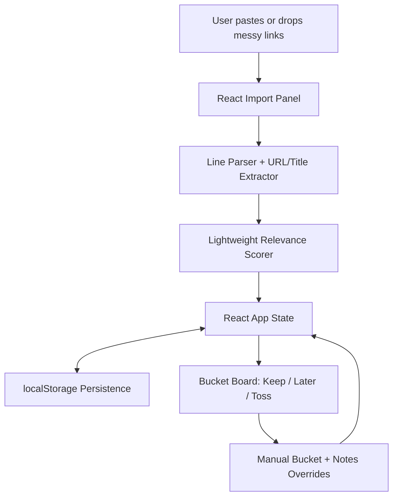

# Tab Triage

A tiny browser-based workspace that lets you quickly sort messy links into three buckets: **keep**, **later**, or **toss**. Paste URLs/titles, let the lightweight relevance scorer rank them, then manually override buckets and add notes.

## Architecture



## Run locally

Requirements: Node.js 18+ and npm.

```bash
npm install
npm run dev
```

Open the printed Vite URL, usually <http://localhost:5173>.

## Build / smoke test

```bash
npm run smoke
```

This compiles TypeScript and creates a production build.

## Environment variables

Copy `.env.example` to `.env` if you want to customize local settings.

| Variable | Required | Default | Description |
| --- | --- | --- | --- |
| `VITE_STORAGE_KEY` | No | `tab-triage-items` | Browser localStorage key used to persist triaged items. |

## Input format

Paste one link per line. Supported examples:

```text
https://react.dev/learn React documentation
SQLite tips - https://sqlite.org/docs.html
A title without URL
https://example.com/article
```

You can also drag and drop a `.txt` file containing the same kind of list.

## Scoring model

The MVP uses a transparent local relevance score from 0-100. It rewards high-signal productivity/engineering/learning terms, recognizable article/documentation domains, clear titles, and slightly penalizes noisy social/shopping/video links. Items are auto-bucketed by score, but every item can be manually moved.
